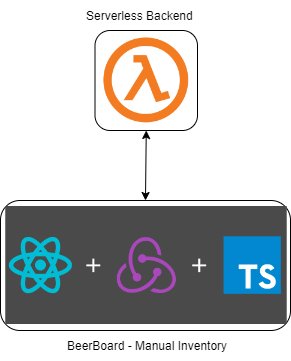
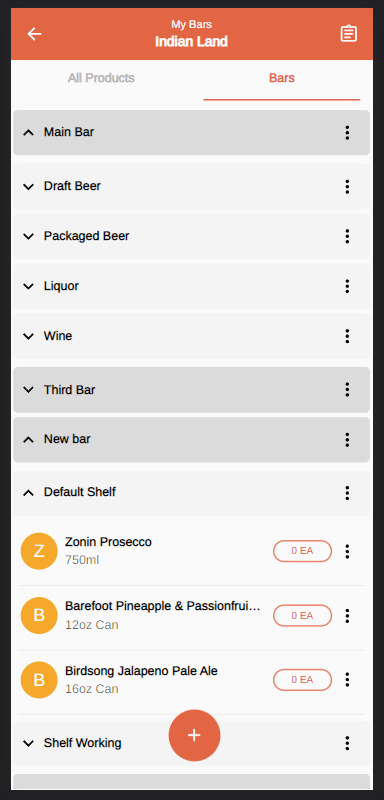
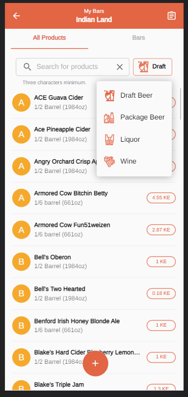
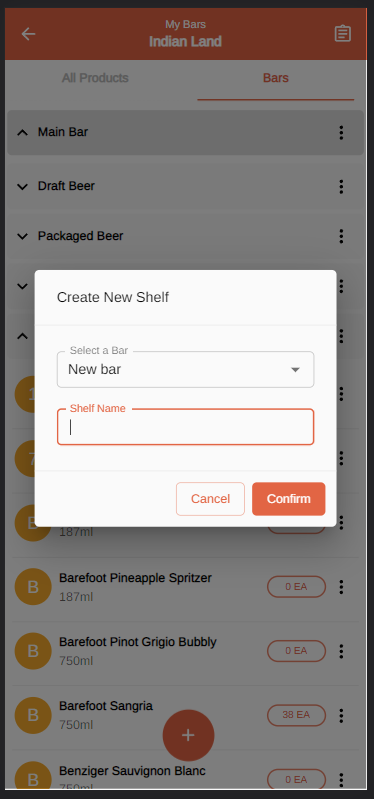
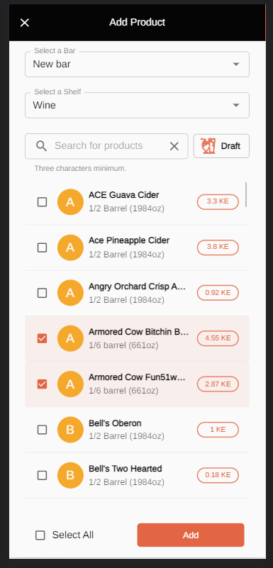
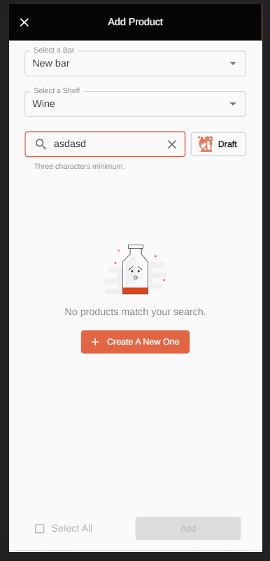
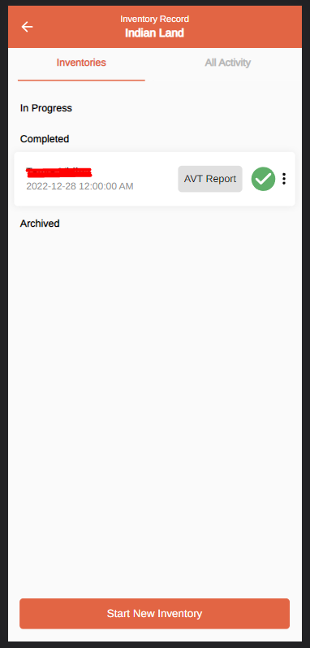
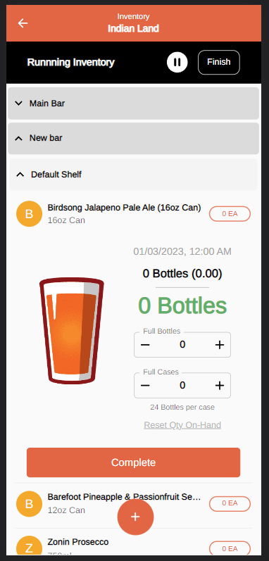
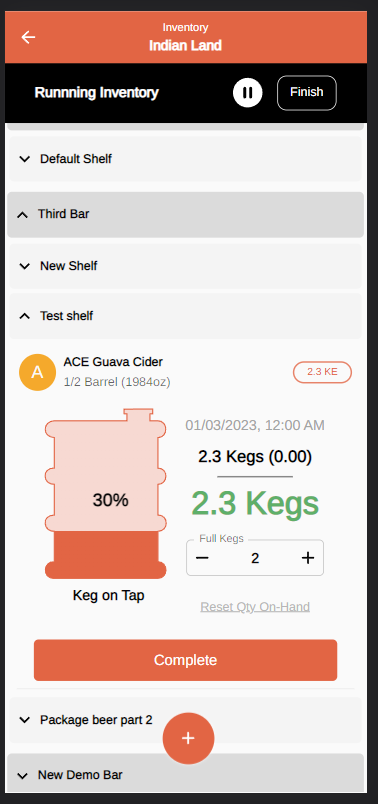
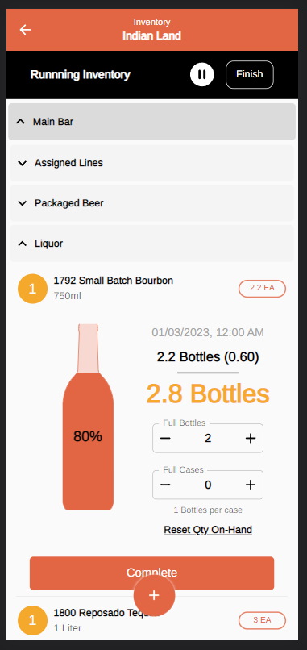

## BeerBoard - Manual Inventory 🍺🍻

 
PWA for bars inventory.

 

## Stack used 💻

### Operations

- Docker and Docker-Compose
- Nginx Web Server/Reverse Proxy
- Let's Encrypt Certbot
- Bash Scripting
- SonarQube code analysis

### Development

- Typescript
- React
- RTK-Query
- Material-UI
- React Beautiful DnD
- Formik

### Some features

- Drag and Drop
- AWS Lambda
- AWS CodePipeline

## Images 📷

